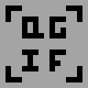

# QuickGIFlick



> Select. Record. GIF.

QuickGIFlick is a Windows GIF recorder built on [ScreenDelta](https://github.com/ARTS-Night/ScreenDelta).
Its Cargo dependency is pinned to the validated ScreenDelta revision so a clean
clone and the Windows CI job build the same capture API.

Brand artwork lives in [`assets/brand`](assets/brand); workflow/status artwork
lives in [`assets/status`](assets/status). These are documentation and
distribution assets; the recorder does not load them at runtime.

## Current milestone

The native Windows controller registers `Win + Shift + G`. It opens a virtual
desktop selection overlay, accepts a selected region, and asks for explicit
Original, Standard, or Hidden cursor choice, then Record or Cancel confirmation. Recording runs on a worker and can be stopped
with `Win + Shift + G` (or the recording HUD). It uses ScreenDelta `Full` / `Delta` /
`Unchanged` updates, then opens an animated Review with elapsed time,
timeline-update count, and a content-aware estimated GIF size. Review replays the
Delta timeline into one reusable canvas; it does not pre-render or retain a new
full frame for every timestamp. Choose **Continue to trim** or **Discard**;
Continue then selects Fast, Balanced, or Best GIF
quality and writes `%USERPROFILE%\\Videos\\QuickGIFlick\\QuickGIFlick_YYYY-MM-DD_HH-MM-SS.gif`.
Encoding runs on its own worker; a native progress window remains responsive
and shows percentage plus elapsed time while the GIF is created.
The recording HUD shows `REC mm:ss` and is excluded from supported Windows
capture paths on a best-effort basis.
Before quality selection, Review provides Start and End fields in seconds,
plus Full range and Cancel. The encoder reconstructs the canvas at the chosen
start timestamp.
While the selection overlay has focus, press `F` for Free, `1` for 1:1, `4`
for 4:3, `9` for 16:9, `0` for 16:10, or `V` for 9:16; the selected rectangle
is constrained while dragging.
The current ScreenDelta backend intentionally reports an error rather than
capturing an invalid region when a selection crosses monitor boundaries.

```powershell
cargo run --release
```

Release builds use the Windows GUI subsystem and do not open a console window.
Use the normal debug build for console diagnostics.

Every push to `main` runs the Windows release build. Download the resulting
`QuickGIFlick-windows-x64-*` artifact from the GitHub Actions run. Pushing a
version tag such as `v0.1.0` also attaches `quickgiflick.exe` to a GitHub
Release.

For development/debugging, run from the repository directory:

```powershell
cargo run                 # console diagnostics + interactive controller
cargo test                # timeline, trim, and cursor-mode checks
cargo clippy -- -D warnings
cargo run --example inspect_gif -- .\recording.gif
```

For a repeatable headless capture check, set the duration and rate before
launching the debug binary:

```powershell
$env:QUICKGIFFLICK_BENCH = '1'
$env:QUICKGIFFLICK_SECONDS = '10'
$env:QUICKGIFFLICK_FPS = '15'
cargo run
Remove-Item Env:QUICKGIFFLICK_BENCH,Env:QUICKGIFFLICK_SECONDS,Env:QUICKGIFFLICK_FPS
```

Set `QUICKGIFFLICK_AUTOSTART=1` when testing the native UI automatically. It
opens Selection immediately and makes temporary controller windows visible to
Windows UI automation; normal launches remain tray-first and capture-excluded.

For repeatable benchmark capture rather than the UI, use
`$env:QUICKGIFFLICK_BENCH=1` and set `QUICKGIFFLICK_SECONDS`.

`QUICKGIFFLICK_QUALITY` accepts `fast`, `balanced` (default), or `best` for
the GIF palette quantizer. These presets do not alter capture resolution or
ScreenDelta's transport policy; see the measured trade-off in
[`docs/experiments/2026-08-29-quality-presets.md`](docs/experiments/2026-08-29-quality-presets.md).

Color cursor shapes are included by default. Selection offers Original,
Standard, or Hidden; set `QUICKGIFFLICK_CURSOR=standard` or `hidden` to select
either mode in an automated capture. Standard maps recognized Windows cursor
handles to the corresponding system cursor and falls back to Arrow.

After Save, choose **Yes** to copy the resulting GIF as a Windows file-drop
clipboard item. This is the natural format for pasting a GIF file into apps
that accept attachments; it is not a decoded bitmap clipboard representation.

The in-memory pixel budget defaults to 32 MiB. Payload beyond that budget is
kept in an automatically removed temporary file so recording memory does not
grow with duration. Set `QUICKGIFFLICK_RECORDING_MEMORY_MB` only when testing a
different budget; it is intentionally not a user-facing setting yet. Set
`QUICKGIFFLICK_SECONDS` only to impose a duration limit for automated capture
tests; interactive recording has no default time limit. Set
`QUICKGIFFLICK_FPS` to a whole value from 1 through 240 (for example 10, 15,
20, or 30) for controlled capture tests; the default is 15.

The controller also keeps a lightweight notification-area icon. Its compact
menu exposes Open, Start Capture, and Exit; the hotkey remains available while
it is resident.

## Where files are saved

Saved GIFs go to `%USERPROFILE%\\Videos\\QuickGIFlick\\`. The directory is
created when needed, and Review displays the exact path after saving. Files use
`QuickGIFlick_YYYY-MM-DD_HH-MM-SS.gif`; saves in the same second receive a
`_01`, `_02`, … suffix instead of overwriting an existing GIF. Temporary
spill files use the Windows temporary directory only when the memory budget is
exceeded and are removed after a successful recording. Spill chunks use fast
lossless compression when it reduces their size; incompressible chunks stay
raw so frames are never discarded. Debug output reports both logical
`spilled_payload_bytes` and physical `spill_file_bytes`. The app does not
upload recordings. Consecutive Full Frames also use a bounded temporal XOR
chain before compression, with periodic independent frames so Trim remains
safe and random-access reconstruction stays bounded.

## Basic operation

1. Press `Win + Shift + G`, or choose **Start Capture** from the tray.
2. Drag a region contained within one monitor; press `F`, `1`, `4`, `9`, `0`,
   or `V` for an aspect ratio. A boundary-crossing selection is rejected before
   recording starts.
3. Choose cursor mode and confirm **Record**.
4. Recording continues until you stop with the HUD button or `Win + Shift + G`.
5. Check the looping animation in Review, then choose **Continue to trim** or
   **Discard**.
6. Optionally enter Start/End seconds, choose quality, then save. After encoding,
   choose whether to copy the saved GIF file to the clipboard.

Run `cargo run` from PowerShell for a debug build with console diagnostics;
the release executable uses the Windows GUI subsystem.
The timeline now supports reconstructing the canvas at an arbitrary timestamp,
which is the correctness primitive used for Trim when a trim start falls after
a Delta update. The capture, bounded recording timeline, and encoder are kept
independent of the Win32 controller.

## Validation

Run `cargo fmt --check`, `cargo check`, `cargo test`, and `cargo clippy -- -D warnings`.
The recorder requires an interactive Windows desktop because it performs real
DXGI capture. `cargo run --release --example inspect_gif -- <path>` verifies a
saved GIF's decodability, frame count, and total GIF delay.

Measured transport, recording, and Windows-controller evidence is consolidated
in [`docs/phase5-report.md`](docs/phase5-report.md).

For controlled encoder experiments only, `QUICKGIFFLICK_GIF_MODE=partial`
uses one bounding GIF rectangle per Delta update. It is not the default until
compatibility testing is complete; see
[`docs/experiments/2026-08-29-partial-gif.md`](docs/experiments/2026-08-29-partial-gif.md).
